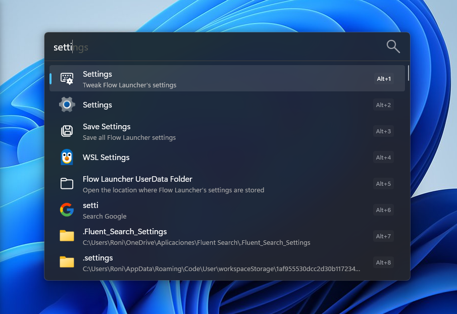
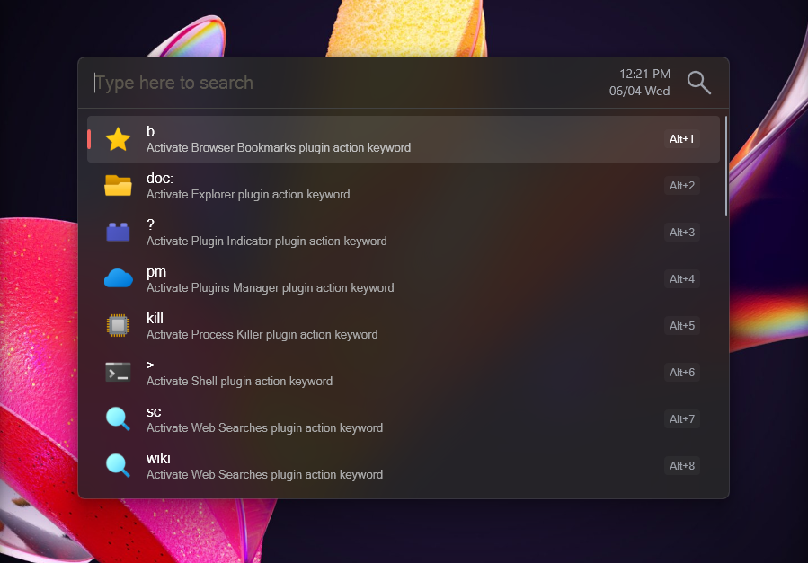
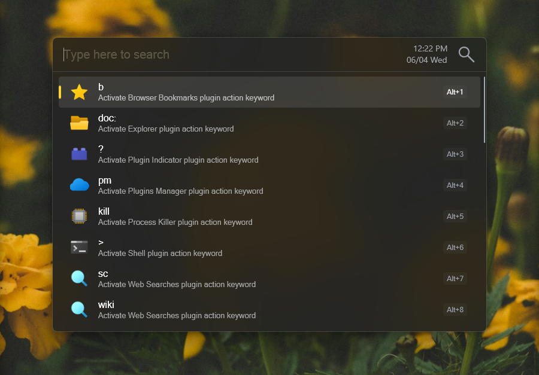

<h1 align="center">True Windows 11 Dark!</h1>

**TrueWin11Dark** is a theme for Flow Launcher that tries to imitate the look of Window 11 dark theme. It's also a modification of [CircleDarkBlur](https://github.com/z1nc0r3/CircleDarkBlur.Flow-Launcher), so all credit goes to [z1nc0r3](https://github.com/z1nc0r3) for creating the base for this theme!

## 🖼️ Galery

  

 <i>with other accent color:</i>

  
  

## 💡 Features

- Blur effect similar to the windows start menu
- Same accent color as the system
- Curved layout
- Version without transparency effect avaiable [here](https://github.com/O-RONI/TrueWin11Dark/blob/main/TrueWin11Dark-Solid.xaml)

## 🛠️ Installation and configuration

1. Go to [TrueWin11Dark.xaml](https://github.com/O-RONI/TrueWin11Dark/blob/main/TrueWin11Dark.xaml). Once you are viewing the file content click **Raw** on the top right corner and `Ctrl+S` to save the theme (or use the **Download raw file** button).

2. Save the theme in your user data directory, usually in `~/AppData/Roaming/FlowLauncher/Themes` directory. If not sure, from flow type `flow launcher userdata` then navigate to the Themes directory.

3. Select **TrueWin11Dark** via flow's theme section.

>[!tip] Recommended settings:
> - Segoe UI fonts
> - acrylic blur!